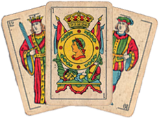

  

# Briscola Morocain Card Game

Brescola is a classic Italian card game played against the computer. This implementation is built using the Qt framework.

## Installation

### Windows

1. Download the installer from the [releases page](https://github.com/aymanerihane/exe).
2. Run the installer and follow the on-screen instructions.
3. Launch the Brescola game after installation.

## How to Play

1. Start the game.
2. Select your preferred settings, such as difficulty level, mute/unmute music/sound, and background color.
3. Read the tutorial.
4. Enjoy the Brescola game!

## Features

- Single-player mode against the computer.
- Choose difficulty levels (easy, medium, hard).
- Customizable background color.
- Mute/unmute music and sounds.

## Controls

- Use the mouse to interact with the game interface.

## License

This project is licensed under the MIT License - see the [LICENSE](LICENSE.txt) file for details.

## Contact

For support or inquiries, contact us at [rihane.aymane@etu.uae.ac.ma](mailto:rihane.aymane@etu.uae.ac.ma) or [kenafi.hiba@etu.uae.ac.ma](mailto:kenafi.hiba@etu.uae.ac.ma).

## Acknowledgments

- The Qt Project for providing a powerful framework.